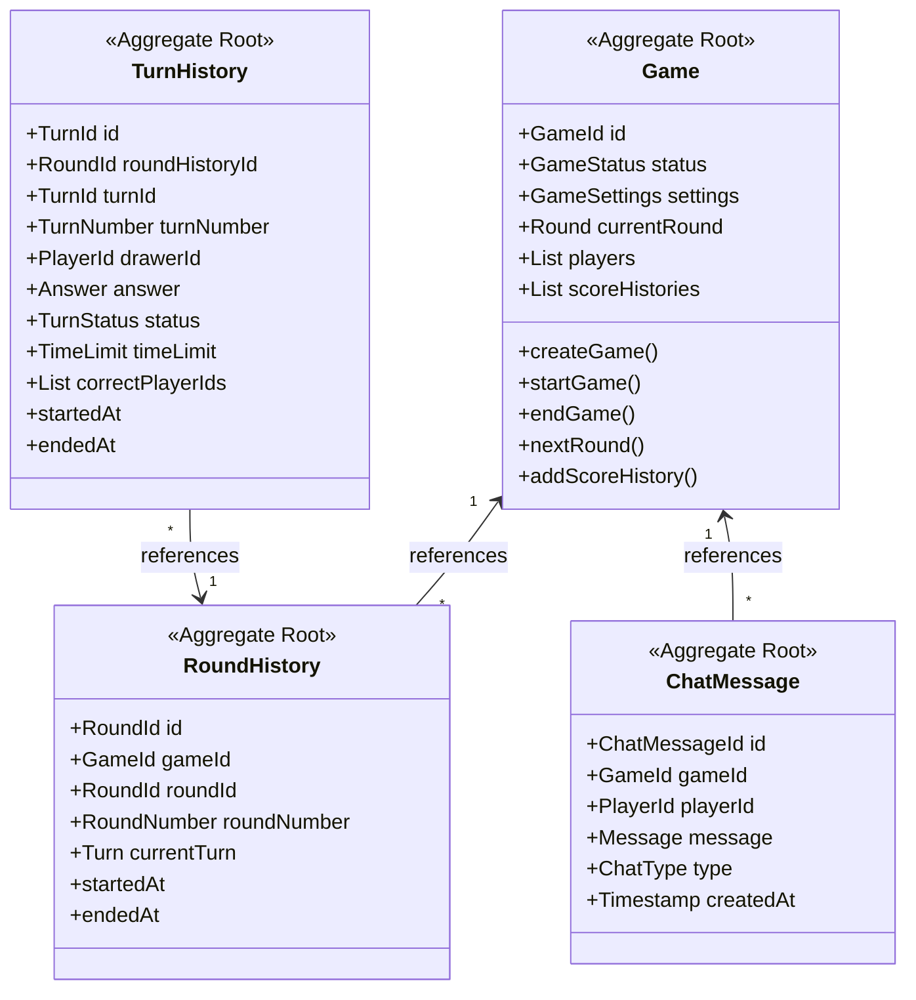
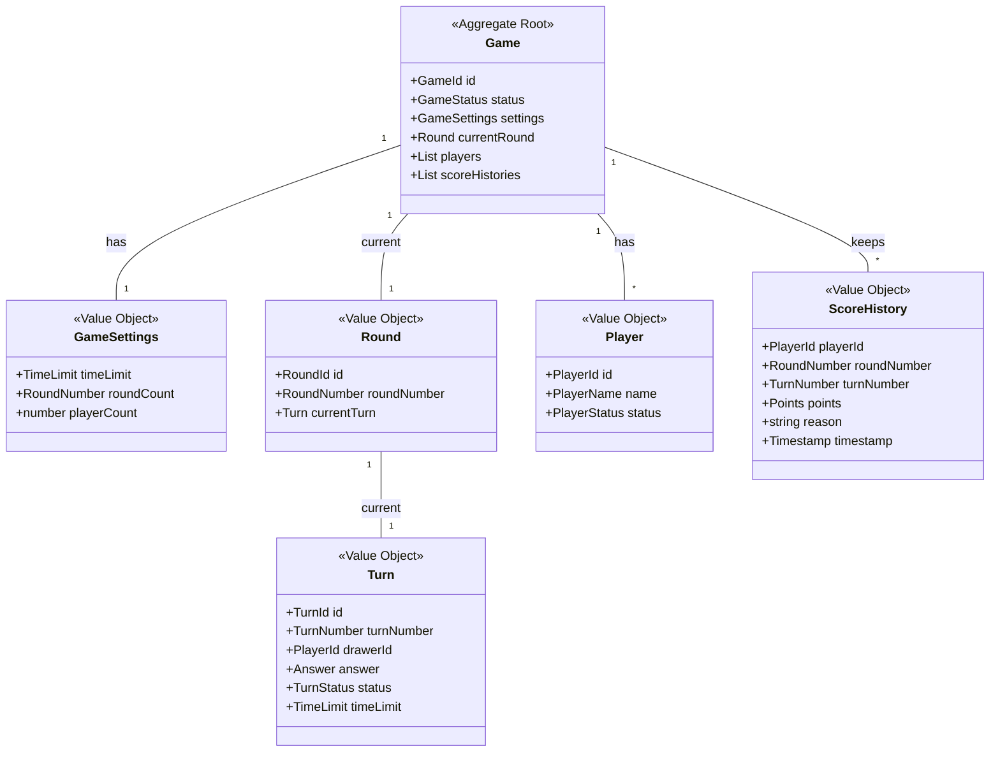
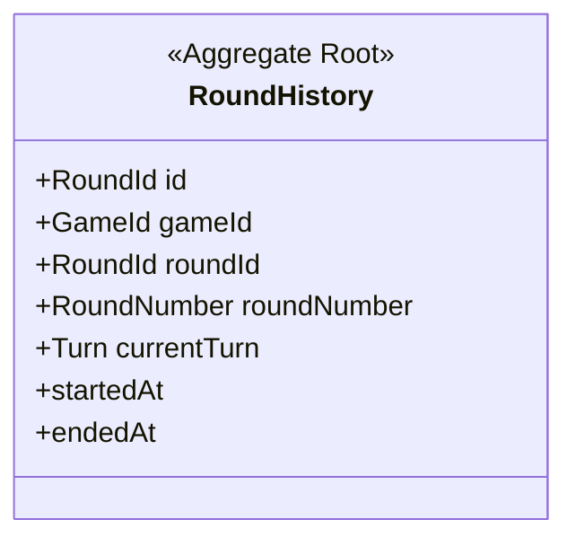
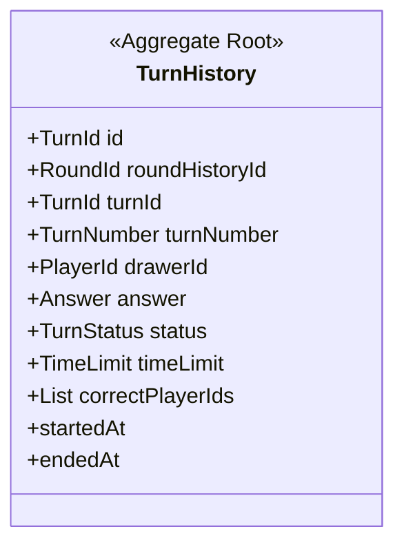
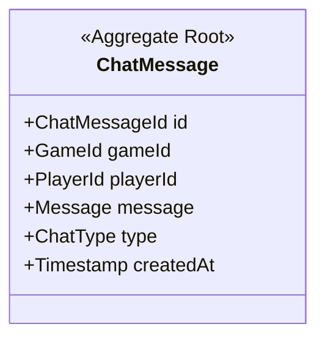

# お絵描き当てゲーム ドメインモデル

## 1. 集約ルートと集約間の関係

## 2. 集約の詳細

---

### Game集約

#### クラス図（全体まとめ）

#### プロパティ
| プロパティ名    | 型                | 説明                   | 制約条件 |
|----------------|-------------------|------------------------|----------|
| id             | GameId            | ゲームID               |          |
| status         | GameStatus        | ゲームの状態           |          |
| settings       | GameSettings      | ゲーム設定             |          |
| currentRound   | Round             | 現在のラウンド         |          |
| players        | Player[]          | 参加プレイヤー一覧     |          |
| scoreHistories | ScoreHistory[]    | スコア履歴             |          |

---

#### Value Object: GameSettings

##### プロパティ
| プロパティ名   | 型        | 説明             | 制約条件 |
|---------------|-----------|------------------|----------|
| timeLimit     | TimeLimit | 制限時間（秒）   |   1-300まで   |
| roundCount    | RoundNumber| ラウンド数       |   1-10    |
| playerCount   | number    | 最大プレイヤー数 |    2-10   |

---

#### Value Object: Round

##### プロパティ
| プロパティ名   | 型         | 説明             | 制約条件 |
|---------------|------------|------------------|----------|
| id            | RoundId    | ラウンドID       |          |
| roundNumber   | RoundNumber| ラウンド番号     |   1-10    |
| currentTurn   | Turn       | 現在のターン     |   1-10    |
| startedAt     | ISO8601    | 開始時刻         |          |
| endedAt       | ISO8601    | 終了時刻         |          |

---

#### Value Object: Turn

##### プロパティ
| プロパティ名   | 型         | 説明             | 制約条件 |
|---------------|------------|------------------|----------|
| id            | TurnId     | ターンID         |          |
| turnNumber    | TurnNumber | ターン番号       |   1-10    |
| drawerId      | PlayerId   | 出題者ID         |          |
| answer        | Answer     | お題             |   ひらがな　1以上50文字以下    |
| status        | TurnStatus | ターンの状態     |          |
| timeLimit     | TimeLimit  | 制限時間（秒）   |    1-300まで      |
| startedAt     | ISO8601    | 開始時刻         |          |
| endedAt       | ISO8601    | 終了時刻         |          |

---

#### Value Object: Player

##### プロパティ
| プロパティ名   | 型         | 説明             | 制約条件 |
|---------------|------------|------------------|----------|
| id            | PlayerId   | プレイヤーID     |          |
| name          | PlayerName | プレイヤー名     |   1－10文字まで       |
| status        | PlayerStatus| プレイヤー状態  |          |

---

#### Value Object: ScoreHistory

##### プロパティ
| プロパティ名   | 型         | 説明             | 制約条件 |
|---------------|------------|------------------|----------|
| playerId      | PlayerId   | プレイヤーID     |          |
| roundNumber   | RoundNumber| ラウンド番号     |  1-10        |
| turnNumber    | TurnNumber | ターン番号       |  1-10        |
| points        | Points     | 獲得ポイント     |   1以上整数       |
| reason        | string     | スコア理由       |          |
| timestamp     | ISO8601    | 記録時刻         |          |

---

### RoundHistory集約

#### クラス図

#### プロパティ
| プロパティ名   | 型         | 説明             | 制約条件 |
|---------------|------------|------------------|----------|
| id            | RoundId    | ラウンド履歴ID   |          |
| gameId        | GameId     | ゲームID         |          |
| roundId       | RoundId    | ラウンドID       |          |
| roundNumber   | RoundNumber| ラウンド番号     |          |
| currentTurn   | Turn       | 現在のターン     |          |
| startedAt     | ISO8601    | 開始時刻         |          |
| endedAt       | ISO8601    | 終了時刻         |          |

---

#### TurnHistory集約

##### クラス図

##### プロパティ
| プロパティ名      | 型         | 説明             | 制約条件 |
|------------------|------------|------------------|----------|
| id               | TurnId     | ターン履歴ID     |          |
| roundHistoryId   | RoundId    | ラウンド履歴ID   |          |
| turnId           | TurnId     | ターンID         |          |
| turnNumber       | TurnNumber | ターン番号       |          |
| drawerId         | PlayerId   | 出題者ID         |          |
| answer           | Answer     | お題             |          |
| status           | TurnStatus | ターンの状態     |          |
| timeLimit        | TimeLimit  | 制限時間（秒）   |    1-300まで      |
| correctPlayerIds | PlayerId[] | 正解者IDリスト   |          |
| startedAt        | ISO8601    | 開始時刻         |          |
| endedAt          | ISO8601    | 終了時刻         |          |

---

### ChatMessage集約

#### クラス図

#### プロパティ
| プロパティ名   | 型         | 説明             | 制約条件 |
|---------------|------------|------------------|----------|
| id            | ChatMessageId | チャットID       |          |
| gameId        | GameId     | ゲームID         |          |
| playerId      | PlayerId   | プレイヤーID     |          |
| message       | Message    | メッセージ内容   |          |
| type          | ChatType   | メッセージ種別   |          |
| createdAt     | ISO8601    | 送信時刻         |          |

---

## 不変条件
- 各集約は独立して存在可能
- 集約間の参照はIDのみを使用
- 集約の整合性は各集約ルートが保証
- ゲームの進行は Game（Aggregate Root）→ Round（Value Object）→ Turn（Value Object）の順序で制御
- ラウンド・ターンの履歴はRoundHistory, TurnHistory（Aggregate Root）で管理
- プレイヤーとチャットは直接Gameと連携