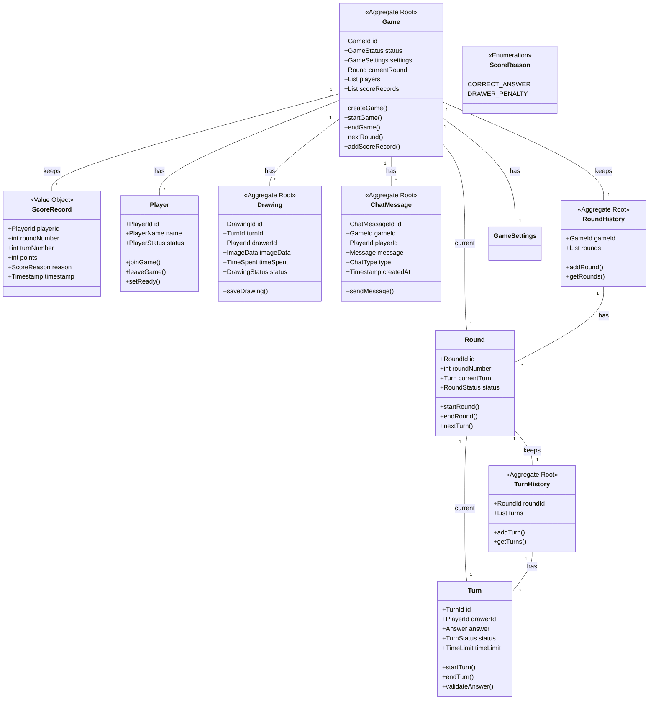
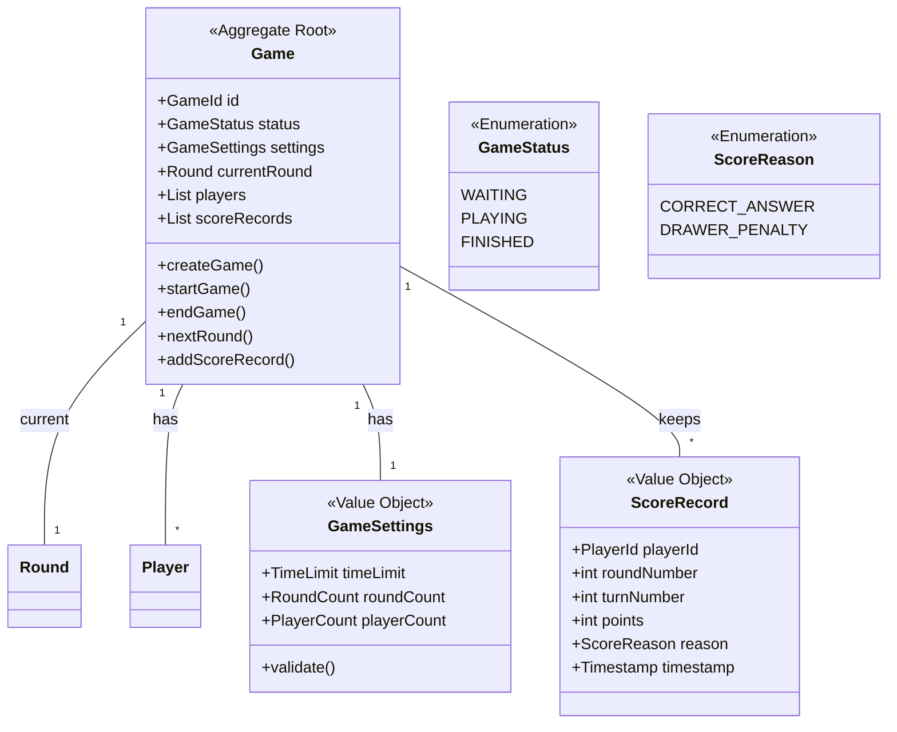
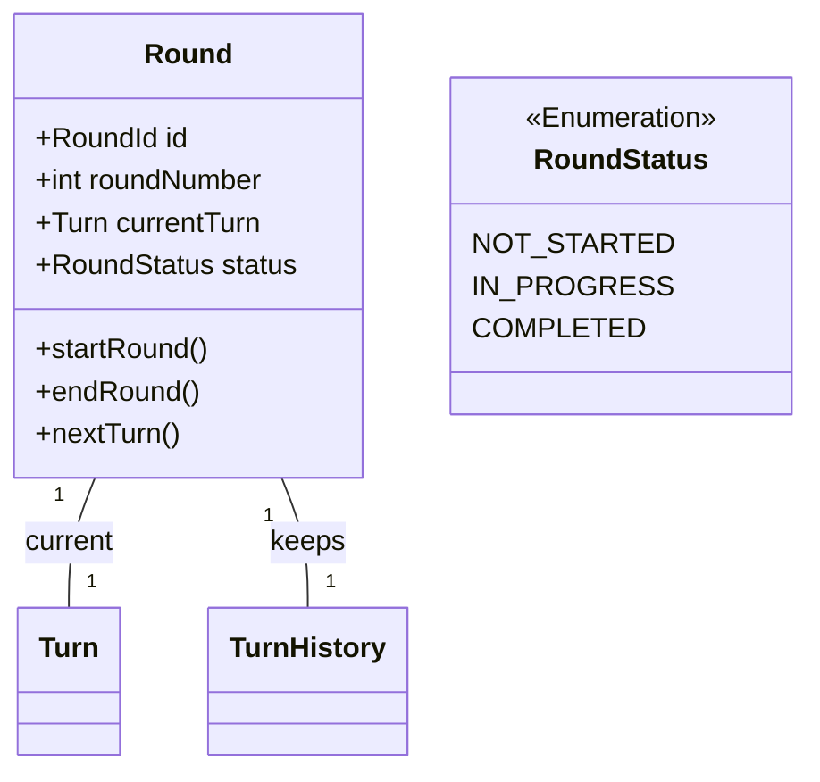
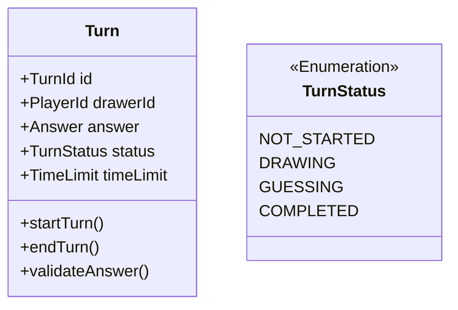
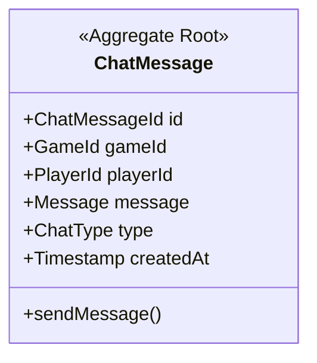
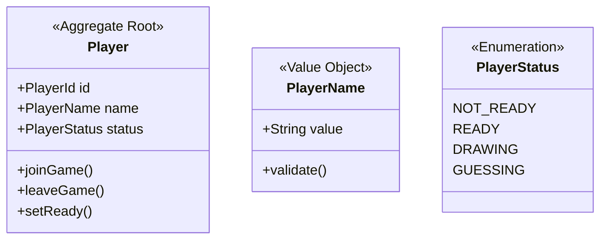
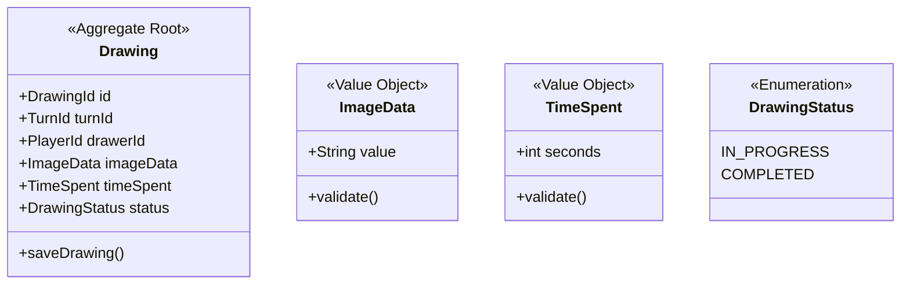

# お絵描き当てゲーム ドメインモデル

## 1. 集約ルートと集約間の関係

## 2. 集約の詳細

### Game集約

#### Game集約の説明
- **Game(ゲーム)**
  - ゲーム全体を管理する集約ルート
  - 現在のラウンド（currentRound）を持ち、進行状態を一元管理
  - スコアはscoreRecords（履歴）として管理し、どのターンで誰が何ポイント得たか記録
  - 履歴はRoundHistory集約で管理
  - プレイヤー・設定も内包

### Round集約

#### Round集約の説明
- **Round(ラウンド)**
  - 現在のターン（currentTurn）を持つ
  - 履歴はTurnHistory集約で管理
  - 状態遷移・進行を管理

### Turn集約

#### Turn集約の説明
- **Turn(ターン)**
  - 1回の描画と回答を管理する集約
  - 出題者・お題・状態・制限時間などを持つ

### ChatMessage集約

#### ChatMessage集約の説明
- **ChatMessage(チャットメッセージ)**
  - 1件のチャット発言を管理する集約
  - ゲームID・プレイヤーID・内容・種別・タイムスタンプを持つ

### Player集約

#### Player集約の説明
- **Player(プレイヤー)**
  - プレイヤー情報を管理する独立した集約ルート
  - スコアは持たず、ゲームのスコア履歴で集計
  - 状態、名前などの属性を持つ
  - ゲームに直接参加

### Drawing集約

#### Drawing集約の説明
- **Drawing(描画)**
  - 描画情報を管理する独立した集約ルート
  - 描画データと状態を管理

## 3. ドメインサービスの説明

### GameProgressService(ゲーム進行サービス)
- ゲーム全体の進行を管理
- ラウンドとターンの遷移を制御
- ゲームの開始と終了を管理

### ScoreCalculationService(スコア計算サービス)
- プレイヤーのスコア計算
- 時間ボーナスの計算
- スコアの更新処理

### AnswerValidationService(回答検証サービス)
- 回答の正誤判定
- 正解時の処理
- 回答の検証ルール管理

### PlayerManagementService(プレイヤー管理サービス)
- プレイヤーの参加・退出管理
- 準備状態の管理
- 描画者の割り当て

### ChatManagementService(チャット管理サービス)
- チャットメッセージの送信
- システムメッセージの配信
- 正解通知の管理

## 不変条件
- 各集約は独立して存在可能
- 集約間の参照はIDのみを使用
- 集約の整合性は各集約ルートが保証
- ゲームの進行は Game → Round → Turn の順序で制御
- プレイヤーとチャットは直接Gameと連携 