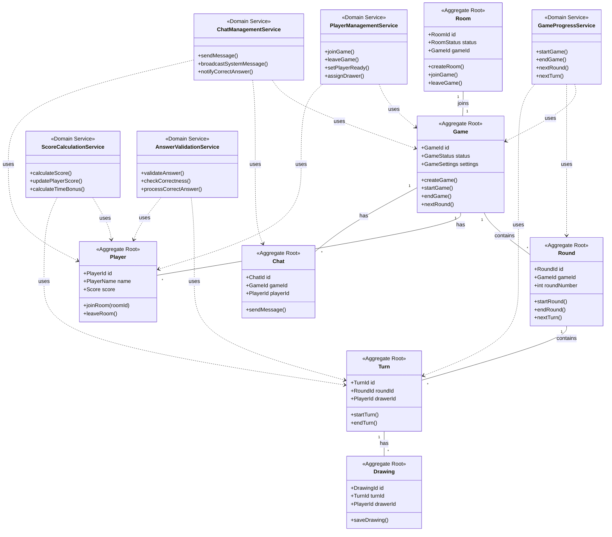
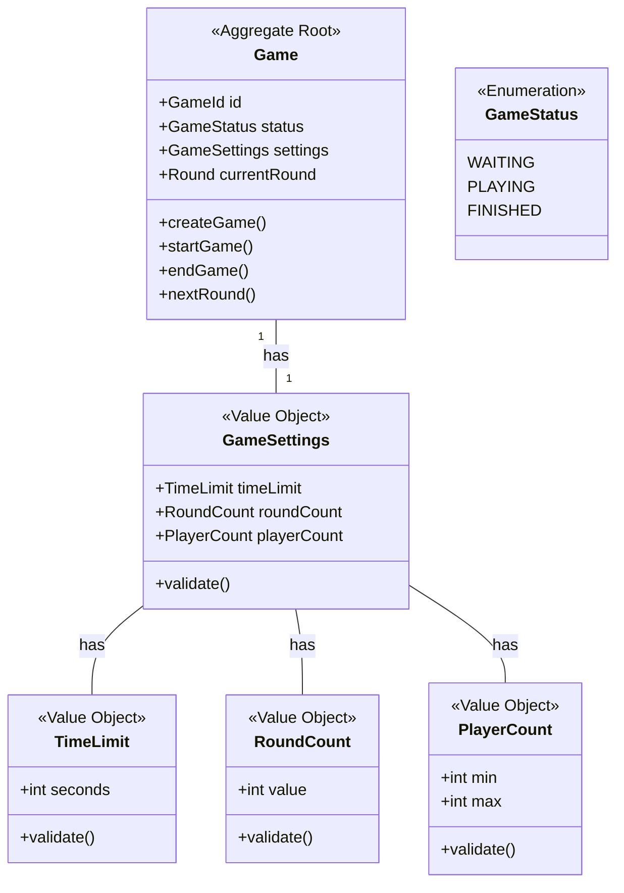
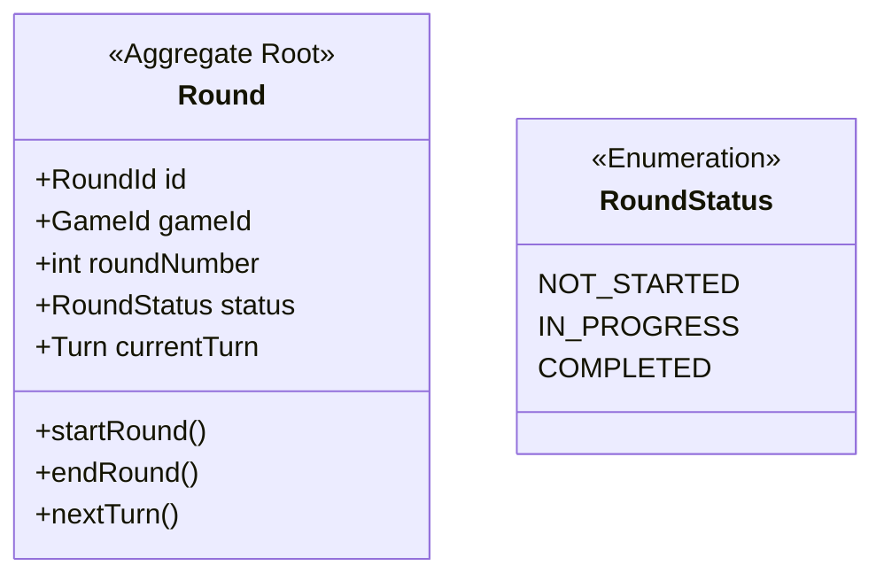
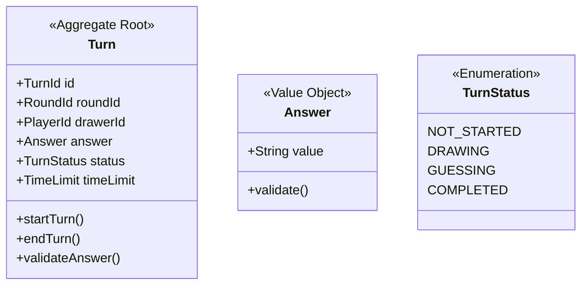
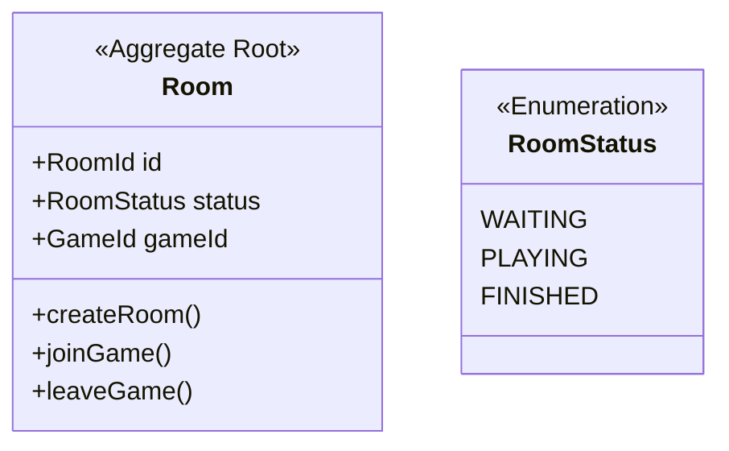
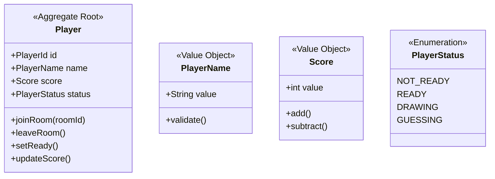
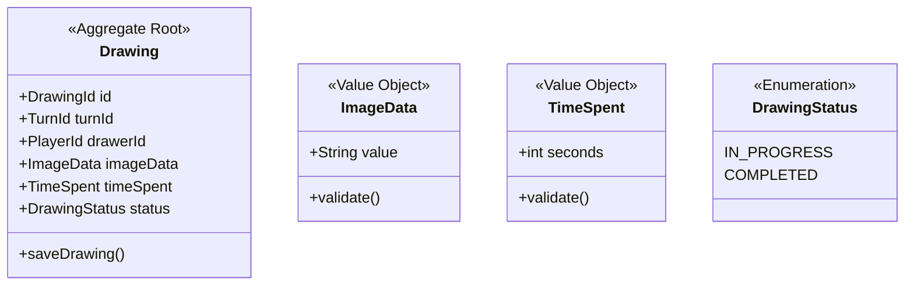
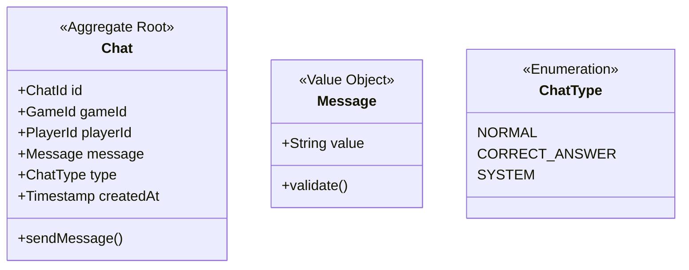

# お絵描き当てゲーム ドメインモデル

## 1. 集約ルートと集約間の関係

## 2. 集約の詳細

### Game集約

#### Game集約の説明
- **Game(ゲーム)**
  - ゲーム全体を管理する集約ルート
  - ゲーム設定と進行状態を管理
  - ラウンドの進行を制御
  - プレイヤーとチャットの管理

- **GameSettings(ゲーム設定)**
  - 制限時間、ラウンド数、プレイヤー数の設定
  - 設定値のバリデーション

### Round集約

#### Round集約の説明
- **Round(ラウンド)**
  - 1回のしりとりを管理する集約ルート
  - ターンの進行を管理
  - ラウンドの状態を制御

### Turn集約

#### Turn集約の説明
- **Turn(ターン)**
  - 1回の描画と回答を管理する集約ルート
  - 描画を管理
  - 正解判定を制御

### Room集約

#### Room集約の説明
- **Room(ルーム)**
  - プレイヤーの集まりを管理する集約ルート
  - ゲームへの参加を管理

### Player集約

#### Player集約の説明
- **Player(プレイヤー)**
  - プレイヤー情報を管理する独立した集約ルート
  - スコア、状態、名前などの属性を持つ
  - ゲームに直接参加

### Drawing集約

#### Drawing集約の説明
- **Drawing(描画)**
  - 描画情報を管理する独立した集約ルート
  - 描画データと状態を管理

### Chat集約

#### Chat集約の説明
- **Chat(チャット)**
  - チャットメッセージを管理する独立した集約ルート
  - メッセージタイプを管理
  - ゲーム全体のコミュニケーションを管理

## 3. ドメインサービスの説明

### GameProgressService(ゲーム進行サービス)
- ゲーム全体の進行を管理
- ラウンドとターンの遷移を制御
- ゲームの開始と終了を管理

### ScoreCalculationService(スコア計算サービス)
- プレイヤーのスコア計算
- 時間ボーナスの計算
- スコアの更新処理

### AnswerValidationService(回答検証サービス)
- 回答の正誤判定
- 正解時の処理
- 回答の検証ルール管理

### PlayerManagementService(プレイヤー管理サービス)
- プレイヤーの参加・退出管理
- 準備状態の管理
- 描画者の割り当て

### ChatManagementService(チャット管理サービス)
- チャットメッセージの送信
- システムメッセージの配信
- 正解通知の管理

## 不変条件
- 各集約は独立して存在可能
- 集約間の参照はIDのみを使用
- 集約の整合性は各集約ルートが保証
- ゲームの進行は Game → Round → Turn の順序で制御
- プレイヤーとチャットは直接Gameと連携 