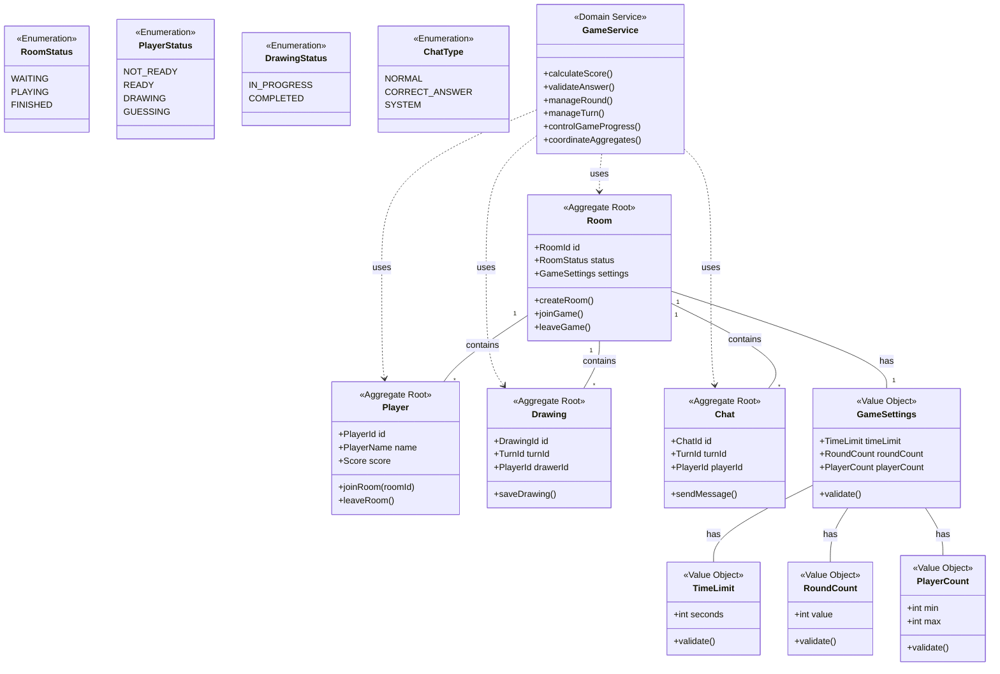

# お絵描き当てゲーム 初期ドメインモデル

## ドメインモデル図

## エンティティの説明

### Room(ルーム)
- ゲームの基本単位となる集約ルート
- プレイヤー、描画、チャットを管理
- ゲーム設定を保持
- ルームの状態を管理

### Player(プレイヤー)
- プレイヤー情報を管理する集約ルート
- スコア、状態、名前などの属性を持つ
- ルームへの参加・退出を管理

### Drawing(描画)
- 描画情報を管理する集約ルート
- 描画データと状態を管理
- ターンと描画者の情報を保持

### Chat(チャット)
- チャットメッセージを管理する集約ルート
- メッセージタイプを管理
- ターンとプレイヤーの情報を保持

### GameSettings(ゲーム設定)
- 制限時間、ラウンド数、プレイヤー数の設定
- 設定値のバリデーション

### GameService(ゲームサービス)
- ゲーム全体の進行を管理
- スコア計算と回答検証
- ラウンドとターンの管理
- 集約間の協調

## 不変条件
- 各集約は独立して存在可能
- 集約間の参照はIDのみを使用
- 集約の整合性は各集約ルートが保証
- ゲームの進行はドメインサービスが制御 