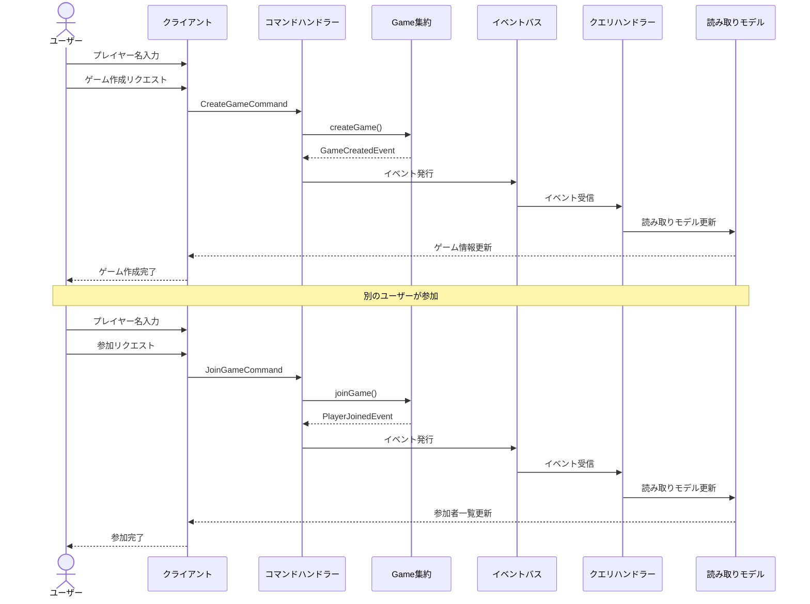
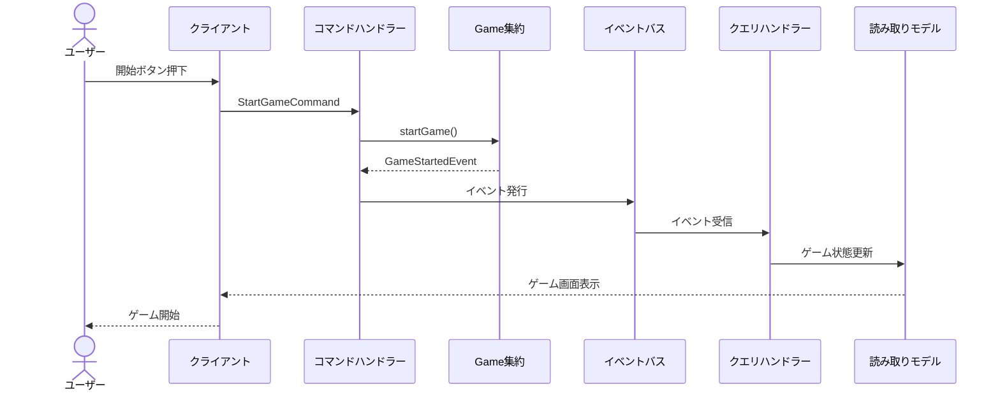
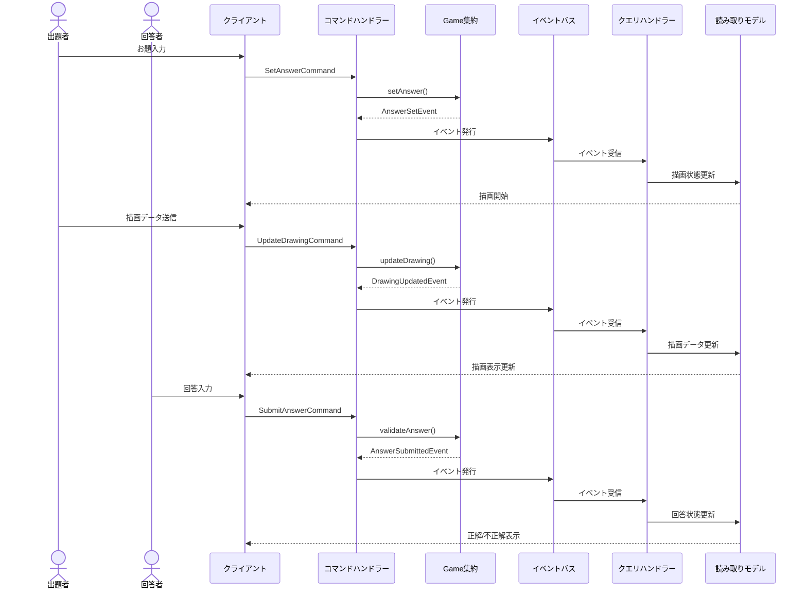
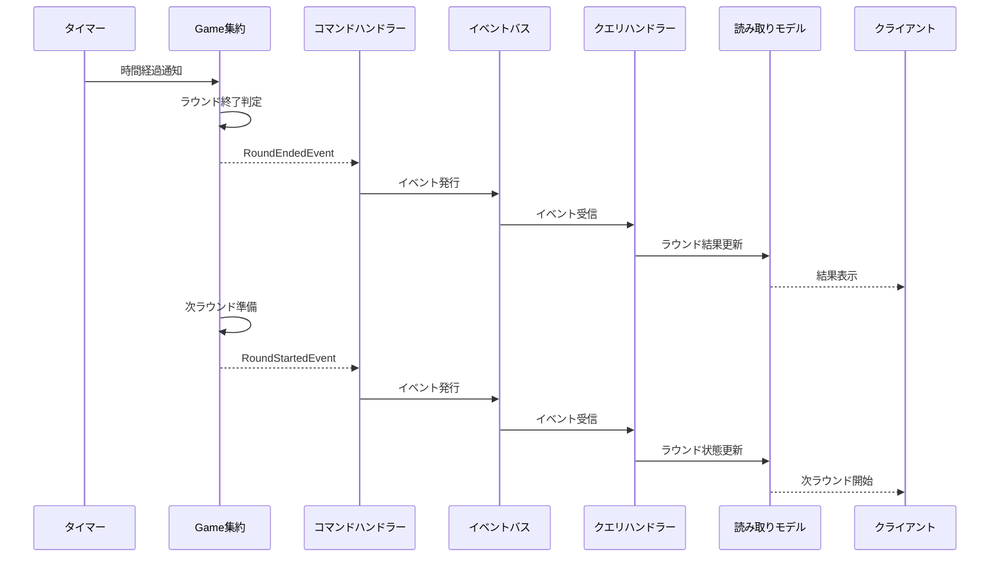
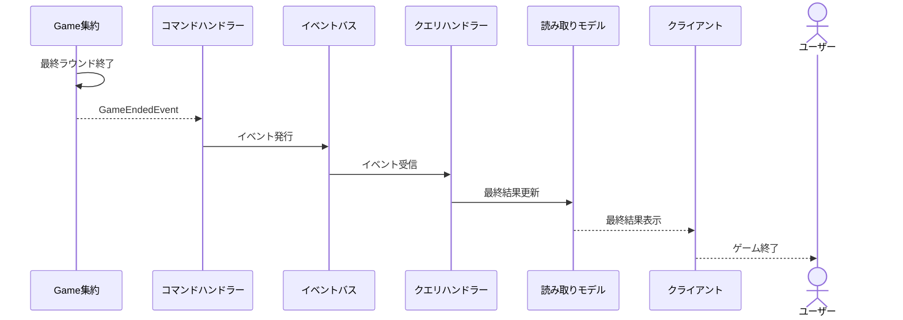
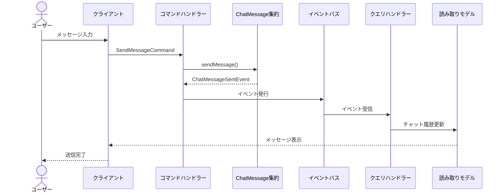

# お絵描き当てゲーム シーケンス図

## 1. ゲーム作成と参加

```mermaid
sequenceDiagram
    actor User as ユーザー
    participant Client as クライアント
    participant Command as コマンドハンドラー
    participant Game as Game集約
    participant Event as イベントバス
    participant Query as クエリハンドラー
    participant ReadModel as 読み取りモデル

    User->>Client: プレイヤー名入力
    User->>Client: ゲーム作成リクエスト
    Client->>Command: CreateGameCommand
    Command->>Game: createGame()
    Game-->>Command: GameCreatedEvent
    Command->>Event: イベント発行
    Event->>Query: イベント受信
    Query->>ReadModel: 読み取りモデル更新
    ReadModel-->>Client: ゲーム情報更新
    Client-->>User: ゲーム作成完了

    Note over User,ReadModel: 別のユーザーが参加
    User->>Client: プレイヤー名入力
    User->>Client: 参加リクエスト
    Client->>Command: JoinGameCommand
    Command->>Game: joinGame()
    Game-->>Command: PlayerJoinedEvent
    Command->>Event: イベント発行
    Event->>Query: イベント受信
    Query->>ReadModel: 読み取りモデル更新
    ReadModel-->>Client: 参加者一覧更新
    Client-->>User: 参加完了
```

## 2. ゲーム開始

```mermaid
sequenceDiagram
    actor User as ユーザー
    participant Client as クライアント
    participant Command as コマンドハンドラー
    participant Game as Game集約
    participant Event as イベントバス
    participant Query as クエリハンドラー
    participant ReadModel as 読み取りモデル

    User->>Client: 開始ボタン押下
    Client->>Command: StartGameCommand
    Command->>Game: startGame()
    Game-->>Command: GameStartedEvent
    Command->>Event: イベント発行
    Event->>Query: イベント受信
    Query->>ReadModel: ゲーム状態更新
    ReadModel-->>Client: ゲーム画面表示
    Client-->>User: ゲーム開始
```

## 3. ターン進行（描画→回答）

```mermaid
sequenceDiagram
    actor Drawer as 出題者
    actor Guesser as 回答者
    participant Client as クライアント
    participant Command as コマンドハンドラー
    participant Game as Game集約
    participant Event as イベントバス
    participant Query as クエリハンドラー
    participant ReadModel as 読み取りモデル

    Drawer->>Client: お題入力
    Client->>Command: SetAnswerCommand
    Command->>Game: setAnswer()
    Game-->>Command: AnswerSetEvent
    Command->>Event: イベント発行
    Event->>Query: イベント受信
    Query->>ReadModel: 描画状態更新
    ReadModel-->>Client: 描画開始

    Drawer->>Client: 描画データ送信
    Client->>Command: UpdateDrawingCommand
    Command->>Game: updateDrawing()
    Game-->>Command: DrawingUpdatedEvent
    Command->>Event: イベント発行
    Event->>Query: イベント受信
    Query->>ReadModel: 描画データ更新
    ReadModel-->>Client: 描画表示更新

    Guesser->>Client: 回答入力
    Client->>Command: SubmitAnswerCommand
    Command->>Game: validateAnswer()
    Game-->>Command: AnswerSubmittedEvent
    Command->>Event: イベント発行
    Event->>Query: イベント受信
    Query->>ReadModel: 回答状態更新
    ReadModel-->>Client: 正解/不正解表示
```

## 4. ラウンド終了と次ラウンド

```mermaid
sequenceDiagram
    participant Timer as タイマー
    participant Game as Game集約
    participant Command as コマンドハンドラー
    participant Event as イベントバス
    participant Query as クエリハンドラー
    participant ReadModel as 読み取りモデル
    participant Client as クライアント

    Timer->>Game: 時間経過通知
    Game->>Game: ラウンド終了判定
    Game-->>Command: RoundEndedEvent
    Command->>Event: イベント発行
    Event->>Query: イベント受信
    Query->>ReadModel: ラウンド結果更新
    ReadModel-->>Client: 結果表示

    Game->>Game: 次ラウンド準備
    Game-->>Command: RoundStartedEvent
    Command->>Event: イベント発行
    Event->>Query: イベント受信
    Query->>ReadModel: ラウンド状態更新
    ReadModel-->>Client: 次ラウンド開始
```

## 5. ゲーム終了

```mermaid
sequenceDiagram
    participant Game as Game集約
    participant Command as コマンドハンドラー
    participant Event as イベントバス
    participant Query as クエリハンドラー
    participant ReadModel as 読み取りモデル
    participant Client as クライアント
    actor User as ユーザー

    Game->>Game: 最終ラウンド終了
    Game-->>Command: GameEndedEvent
    Command->>Event: イベント発行
    Event->>Query: イベント受信
    Query->>ReadModel: 最終結果更新
    ReadModel-->>Client: 最終結果表示
    Client-->>User: ゲーム終了
```

## 6. チャット送信

```mermaid
sequenceDiagram
    actor User as ユーザー
    participant Client as クライアント
    participant Command as コマンドハンドラー
    participant Chat as ChatMessage集約
    participant Event as イベントバス
    participant Query as クエリハンドラー
    participant ReadModel as 読み取りモデル

    User->>Client: メッセージ入力
    Client->>Command: SendMessageCommand
    Command->>Chat: sendMessage()
    Chat-->>Command: ChatMessageSentEvent
    Command->>Event: イベント発行
    Event->>Query: イベント受信
    Query->>ReadModel: チャット履歴更新
    ReadModel-->>Client: メッセージ表示
    Client-->>User: 送信完了
``` 