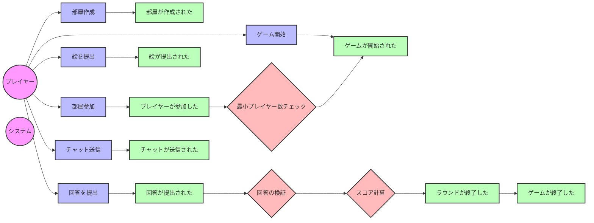

# イベントストーミング図の説明

## アクター
- プレイヤー: ゲームの参加者
- システム: ゲームの進行を管理するシステム

## コマンド
- 部屋作成: 新しいゲームルームを作成
- 部屋参加: 既存のルームに参加
- ゲーム開始: ゲームを開始
- 絵を提出: お題に基づいて絵を描いて提出
- 回答を提出: 描かれた絵に対する回答を提出
- チャット送信: チャットメッセージを送信

## イベント
- 部屋が作成された: 新しいゲームルームが作成された
- プレイヤーが参加した: プレイヤーがルームに参加した
- ゲームが開始された: ゲームが開始された
- 絵が提出された: プレイヤーが絵を提出した
- 回答が提出された: プレイヤーが回答を提出した
- チャットが送信された: チャットメッセージが送信された
- ラウンドが終了した: 1ラウンドが終了した
- ゲームが終了した: ゲームが終了した

## ポリシー
- 最小プレイヤー数チェック: ゲーム開始に必要な最小プレイヤー数を確認
- 回答の検証: 提出された回答が正解かどうかを検証
- スコア計算: プレイヤーのスコアを計算 