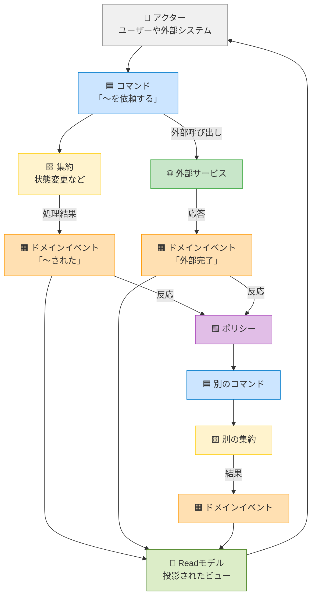
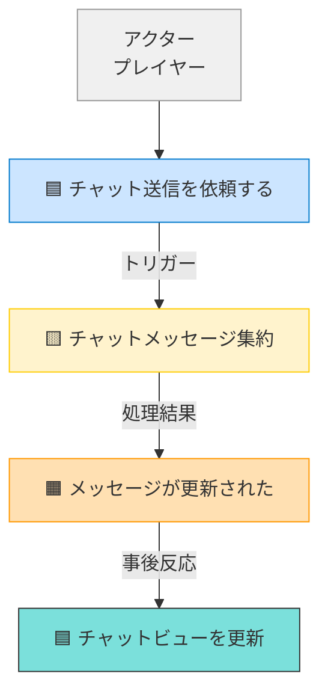
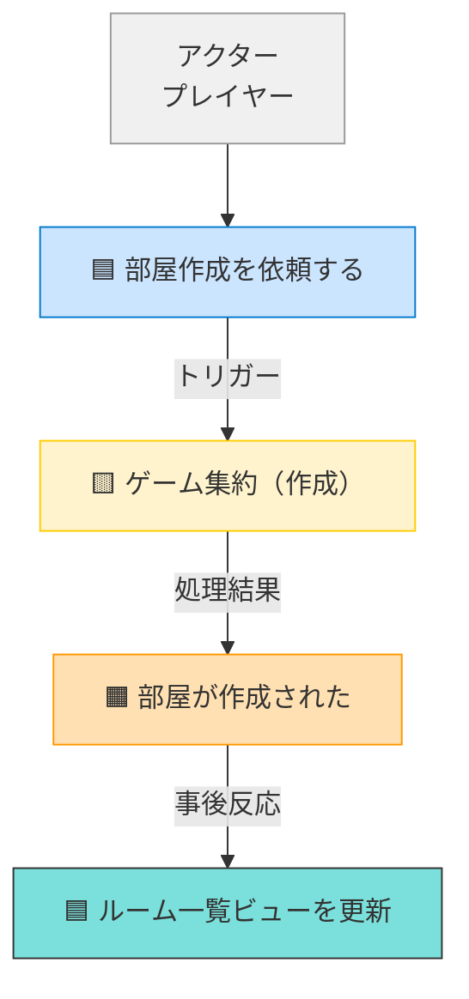
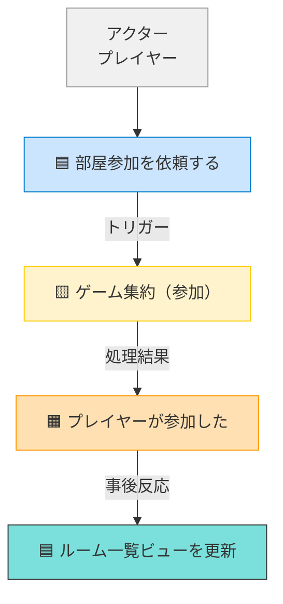
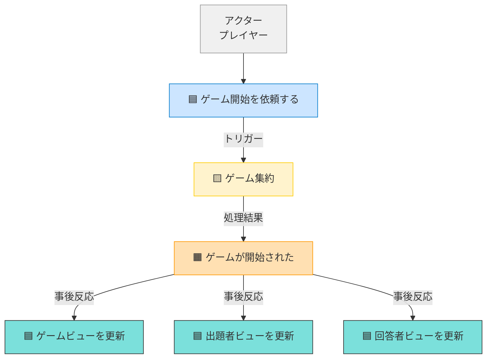
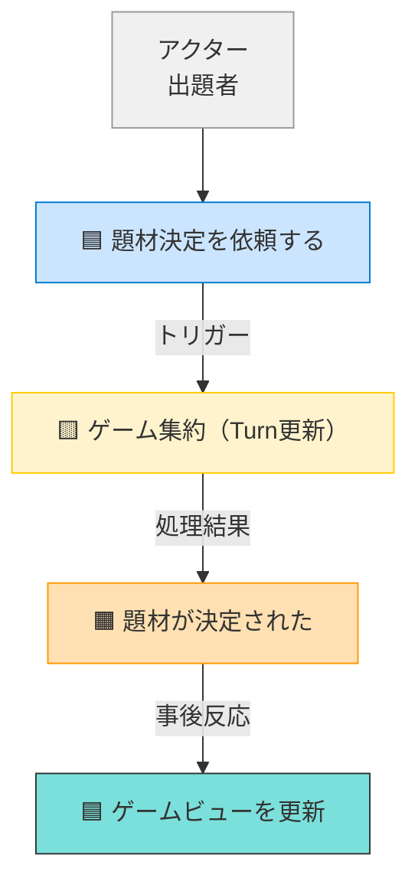
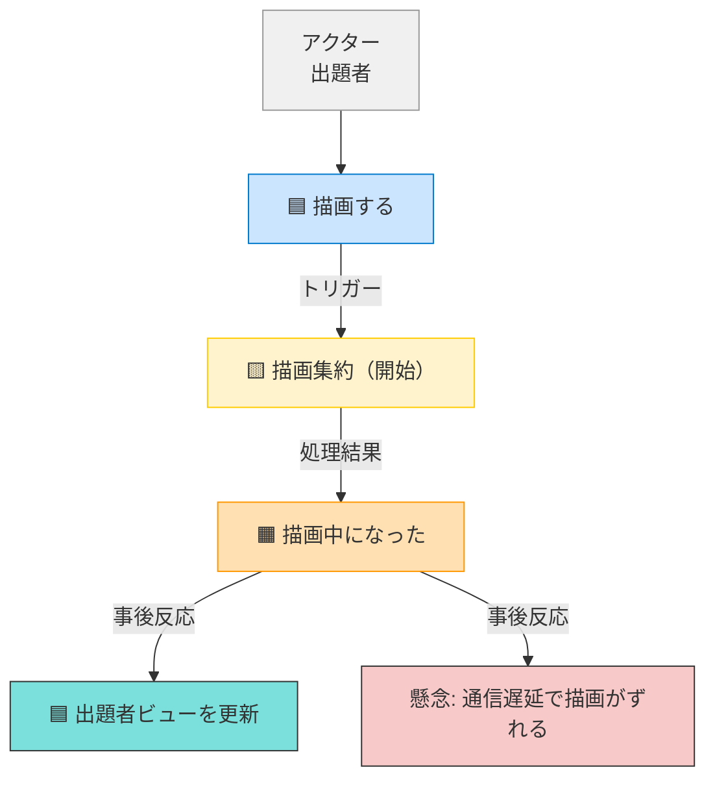
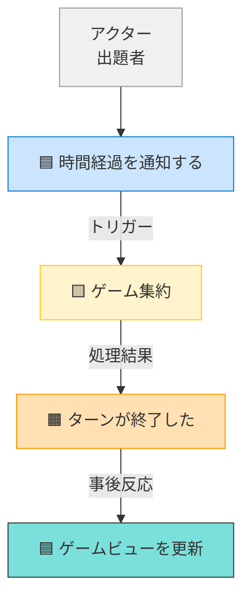
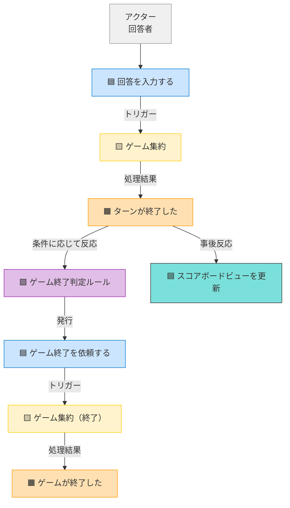

# 📚 イベントストーミングのルールと構成図

## 🎯 概要

イベントストーミングは、業務の流れを「起きたこと（イベント）」中心に整理し、ドメイン知識・システム構成・外部とのやりとりを俯瞰するワークショップ手法です。

---

## 🟧 使用するカードの種類と意味

| 色       | 名前             | 役割の説明                             |
|----------|------------------|----------------------------------------|
| 👤 灰     | アクター         | システムを使う人や外部システム         |
| 🟦 青     | コマンド         | アクターからの操作要求                 |
| 🟨 黄     | 集約             | 一貫性を保った状態変化の単位           |
| 🟧 橙     | ドメインイベント | ビジネス上「起きたこと」の記録         |
| 🟪 紫     | ポリシー         | イベント発生時に追加で取るべきアクション |
| 🌐 緑     | 外部サービス     | 外部システムとの連携先                 |
| 📘 緑薄   | Readモデル       | クエリ応答用のビュー（投影）           |

---

## ✅ イベントストーミングの基本ルール

### 1. **アクターはすべての出発点**
- ユーザーまたは外部システムが何かを「やりたい」と思った瞬間からストーリーが始まる

### 2. **コマンドは意図を表す**
- 「やってほしいこと」（例：注文を確定する、面接を予約する）
- 原則1つのコマンドは1つの集約に責務を持つ

### 3. **集約は状態変更の境界**
- 一貫性を保ちながら内部状態を変える
- ドメインイベントを発行して「何が起きたか」を外に知らせる

### 4. **ドメインイベントは不可逆の事実**
- 「○○された」「××が完了した」など過去形で表現される

### 5. **外部サービスへの呼び出しは副作用**
- コマンドが契機で外部呼び出しが発生し、成功時にイベントが発行される

### 6. **ポリシーはイベントに対するルール的な反応**
- ドメインイベントに反応して、新たなコマンドや外部連携を発生させる

### 7. **Readモデルはイベントを投影した表示用ビュー**
- ドメインイベントに応じて更新され、ユーザーにフィードバックを返す

---

## 🔁 よくある流れパターン

### 🌀 状態変更系

```text
👤 アクター
↓
🟦 コマンド
↓
🟨 集約が処理・状態変更
↓
🟧 ドメインイベント
↓
📘 Readモデルに反映
↓
👤 アクターが結果を確認
```
## 🌐 外部呼び出しを含むパターン

```text
👤 アクター
↓
🟦 コマンド
↓
🌐 外部サービスに連携
↓
🟧 外部完了イベント
↓
🟪 ポリシーが反応
↓
🟦 別のコマンド発行
↓
🟨 別の集約が状態変更
↓
🟧 ドメインイベント
↓
📘 Readモデル更新 → 👤 に表示
```

## 📊 全体構成図（Mermaid）



✅ ゴール
ドメイン理解の共通言語を築く

ユースケース・責務・処理の粒度を整理する

開発・ビジネス・UX・インフラが共通認識を持てる土台を作る


## 要素の説明

### ドメインイベント（Domain Event）
ビジネスドメインにとって関心のある出来事を記述します。
一貫性を持たせるため、以下の作成要領で表現します。
1. 過去形動詞を使う
2. 専門用語を使用しない
3. シンプルに言葉を保つ

---

### コマンド（Command）
ドメインイベントにつながるトリガまたは操作を記述します。
ユーザーアクション、外部システム、または時間ベースの活動から取得できます。
ユーザーが起動したコマンドの場合、システム内の特定のコマンドを一覧して呼び出すことができる役割を記述します。

---

### 集約（Aggregate）
コマンドが処理できるデータを記述します。
集約は、1つまたは複数のエンティティの整合を保つ境界を定義します。
集約内の1つのエンティティがルートになります。

---

### 方針（Policy）
ドメインイベントの結果として実行されるロジックを記述します。
例：「Xの場合はYを実行」など。
1つのドメインイベントが複数の方針につながる可能性があります。

---

### 外部システム（External System）
ドメインの対話が必要なドメインの外側にある管理対象外のソフトウェア、あるいは組織体などを記述します。
（外部のクラウドサービス、サードパーティのアグリゲーション、ワークショップに参加している他部門、外部組織など）

---

### 読み取りモデル（Read Model）
何らかのアクションを実行するために必要なデータを記述します。
集約とは別のもので、画面上に表示する必要があるものなどです。
例：意思決定を行うためにユーザー画面に表示されるデータ。

---

### 懸念事項（Issue）
参加者からの説明が必要な懸念事項を記述します。
例：
- 完全に理解していない人がいる
- 意図と異なる意思決定をする人がいる
- 与えられたステップについて警告する人がいる
- 参加者の終わりのない議論が続く
など

---


# イベントストーミング図の説明

## ユースケース別の説明

### 1. ルーム作成
- **アクター**: プレイヤー
- **コマンド**: 部屋作成
- **イベント**: 部屋が作成された

### 2. ルーム参加
- **アクター**: プレイヤー
- **コマンド**: 部屋参加
- **イベント**: プレイヤーが参加した
- **ポリシー**: 最小プレイヤー数チェック

### 3. ゲーム開始
- **アクター**: プレイヤー
- **コマンド**: ゲーム開始、役割割り当て
- **イベント**: ゲームが開始された、役割が割り当てられた

### 4. 出題者
- **アクター**: 出題者
- **コマンド**: 題材を決定、描画開始、描画更新
- **イベント**: 題材が提出された、描画中、描画が更新された、制限時間超過、絵が提出された

### 5. 回答者
- **アクター**: 回答者
- **コマンド**: 描画を表示、回答を提出
- **イベント**: 描画が表示された、回答が提出された、正解、不正解、ラウンドが終了した、ゲームが終了した
- **ポリシー**: 回答の検証、スコア計算

### 6. チャット


## 要素の説明

### アクター
- プレイヤー: ゲームの参加者
- 出題者: 絵を描く役割のプレイヤー
- 回答者: 絵を当てる役割のプレイヤー

### コマンド
- 部屋作成: 新しいゲームルームを作成
- 部屋参加: 既存のルームに参加
- ゲーム開始: ゲームを開始
- 役割割り当て: プレイヤーに出題者と回答者の役割を割り当て
- 題材を決定: 描く絵の題材をテキストで入力
- 描画開始: 絵を描き始める
- 描画更新: 描画内容を更新
- 描画を表示: 描画中の絵を表示
- 回答を提出: 描かれた絵に対する回答を提出
- チャット送信: チャットメッセージを送信

### イベント
- 部屋が作成された: 新しいゲームルームが作成された
- プレイヤーが参加した: プレイヤーがルームに参加した
- ゲームが開始された: ゲームが開始された
- 役割が割り当てられた: プレイヤーに出題者と回答者の役割が割り当てられた
- 題材が提出された: 出題者が題材を決定した
- 描画中: 出題者が絵を描いている状態
- 描画が更新された: 描画内容が更新された
- 制限時間超過: 描画の制限時間が終了した
- 絵が提出された: 出題者が絵の描画を完了した
- 描画が表示された: 回答者が描画中の絵を表示した
- 回答が提出された: プレイヤーが回答を提出した
- 正解: 回答者が正解を当てた
- 不正解: 回答者の回答が不正解だった
- チャットが送信された: チャットメッセージが送信された
- ラウンドが終了した: 1ラウンドが終了した
- ゲームが終了した: ゲームが終了した

### ポリシー
- 最小プレイヤー数チェック: ゲーム開始に必要な最小プレイヤー数を確認
- 回答の検証: 提出された回答が正解かどうかを検証
- スコア計算: プレイヤーのスコアを計算（正解した回答者と出題者の両方に加算）

## ユースケース別イベントストーミング図（全体構成図スタイル）

### 1. ルーム作成


---

### 2. ルーム参加


---

### 3. ゲーム開始


---

### 4. 出題


---

### 4-1. 描画開始


---

### 4-2. 時間経過によるターン終了


---

### 5. 回答


---

### 6. チャット
